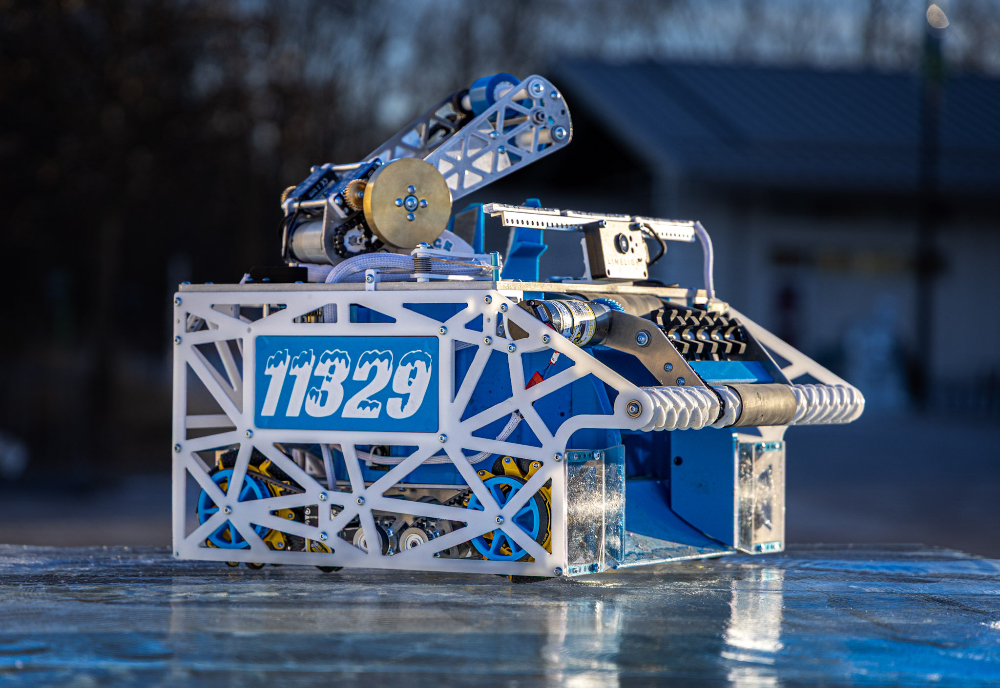

# 11329 2026 Robot Code - Hailstorm

This is the code for FTC team 11329's 2026 competition robot Hailstorm.

We placed winning alliance captain at Michiana, winning alliance first pick at the Edison Division of worlds, and winning alliance captain at Indiana State. [FtcScout](https://ftcscout.org/teams/11329?season=2025)

[`MainTeleop.java`](./TeamCode/src/main/java/org/firstinspires/ftc/teamcode/teleops/MainTeleop.java) is the main driver-controlled op mode. It manages input from two drivers, handling drivetrain movement, shooting, intaking, and climbing.

The [`autos/`](./TeamCode/src/main/java/org/firstinspires/ftc/teamcode/autos) folder contains the autonomous programs for all four starting positions. We use [Pedro Pathing](https://github.com/Pedro-Pathing/PedroPathing) for smooth, accurate path following and run through intake-shoot cycles to score as many balls as possible before the driver-controlled period begins.
